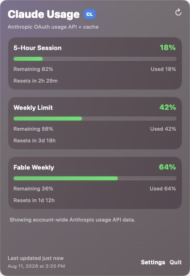
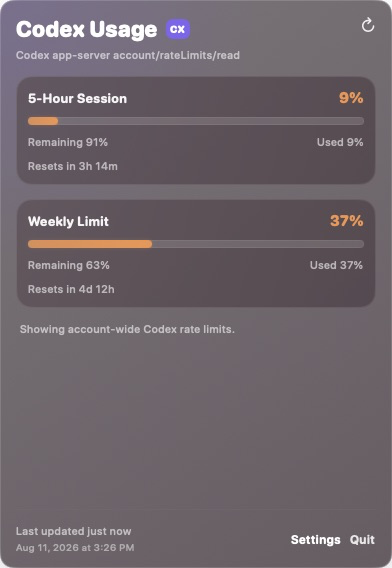

# agent-bar

`agent-bar` is a small macOS menu bar app for monitoring Claude Code and Codex usage limits without switching to either client.

Each detected provider gets its own menu bar item. The label shows the current 5-hour usage percentage beside compact stacked limit bars; click it to see used and remaining percentages, reset times, data freshness, and model-specific Claude limits.

## Screenshots

<table>
  <tr>
    <td width="50%"></td>
    <td width="50%"></td>
  </tr>
  <tr>
    <td align="center"><strong>Claude</strong></td>
    <td align="center"><strong>Codex</strong></td>
  </tr>
</table>

<p align="center"><sub>Representative values rendered with the current interface. Your limits depend on your provider and account.</sub></p>

## What It Shows

- Separate menu bar items for Claude and Codex
- Provider-reported 5-hour and weekly usage limits
- Used percentage, remaining percentage, and reset time for each available window
- Claude model-specific weekly limits returned by Anthropic, with Fable pinned first
- A persistent Fable weekly card; unavailable data is shown as `--`, never as a misleading `0%`
- Manual refresh and configurable 60, 120, 300, or 600 second refresh intervals
- Login-required, unavailable, stale, and last-known-good states
- No backend service, telemetry, browser-cookie access, or local session-log scanning

The compact Claude item uses three stacked bars for the 5-hour, overall weekly, and Fable weekly limits. The Codex item uses two bars for its 5-hour and weekly limits.

## Requirements

- macOS 14 or later
- A Swift 6.2-capable toolchain for running or building from source (`swift --version`)
- Claude: Claude Code installed or Claude OAuth credentials detectable; sign in to Claude Code for direct OAuth API usage
- Codex: a signed-in Codex CLI, Node.js, and `/usr/bin/python3`

AgentBar recognizes these executable locations:

- Claude: `~/.local/bin/claude`, `~/.bun/bin/claude`, `/opt/homebrew/bin/claude`, `/usr/local/bin/claude`
- Codex: `~/.bun/bin/codex`, `/opt/homebrew/bin/codex`, `/usr/local/bin/codex`
- Node.js: `~/.bun/bin/node`, `/opt/homebrew/bin/node`, `/usr/local/bin/node`, `/usr/bin/node`

Claude credential discovery checks the macOS Keychain and `<Claude config directory>/.credentials.json`. It also honors `CLAUDE_CONFIG_DIR`; otherwise the config directory is `~/.claude`.

Providers are detected when AgentBar launches. If a provider item was absent because its executable or credentials were not detected, install or sign in to the provider and restart AgentBar. If the item is already visible, signing in and choosing **Refresh Now** is enough.

## Run From Source

```bash
git clone https://github.com/chenjingdev/agent-bar.git
cd agent-bar
swift run agent-bar
```

AgentBar is an accessory app: it appears in the macOS menu bar, not the Dock. The first refresh starts automatically, so placeholder values may appear briefly at launch.

## Build a Local App Bundle

Build an ad-hoc signed local app bundle:

```bash
cd agent-bar
./scripts/build-app.sh
open AgentBar.app
```

Or build it and copy it to `~/Applications`:

```bash
cd agent-bar
./scripts/build-app.sh --install
open ~/Applications/AgentBar.app
```

An Apple Developer account is not required for local use. The bundle is not notarized for distribution, so Gatekeeper may warn if it is moved to another Mac.

## How Usage Is Read

### Claude

AgentBar prefers a fresh Claude Code status-line sample when the optional bridge below is configured. Otherwise it uses a short-lived cache or requests `https://api.anthropic.com/api/oauth/usage` with the locally stored Claude OAuth credential.

The primary weekly card prefers Anthropic's overall weekly window. If Anthropic does not return one, AgentBar follows an available provider-reported scoped weekly window and explains that fallback in the popover.

Model-specific weekly rows, including Fable, come from the OAuth usage response or its cache. A fresh status-line sample provides the 5-hour and overall weekly windows but does not create model-specific data. When Fable is not returned for the current account or plan, its card remains visible with `--` and an empty bar.

### Codex

AgentBar starts the local `codex app-server` and reads `account/rateLimits/read`. The returned primary and secondary windows are displayed as the 5-hour and weekly limits.

## Optional Claude Status-Line Bridge

The repository includes `scripts/claude-statusline-bridge.sh`, but it is not installed or configured automatically. The bridge copies Claude Code's status-line JSON input to `~/.agentbar/claude-statusline.json`; when it finds Claude HUD, it also forwards the same input to Claude HUD.

To enable it, preserve your other Claude settings and set `statusLine.command` in `<Claude config directory>/settings.json` to the script's absolute path. The config directory is `CLAUDE_CONFIG_DIR` when set, otherwise `~/.claude`.

```json
{
  "statusLine": {
    "type": "command",
    "command": "/absolute/path/to/agent-bar/scripts/claude-statusline-bridge.sh"
  }
}
```

Changing `statusLine.command` replaces the current status-line command. Review any existing configuration first; the included bridge knows how to forward to Claude HUD, but it does not automatically preserve other custom status-line commands. Restart Claude Code after changing the setting.

AgentBar accepts status-line samples that are less than two minutes old. Without the bridge, Claude usage still works through the OAuth usage API when valid credentials are available.

## Refresh, Cache, and Privacy

The default refresh interval is 120 seconds. It can be changed to 60, 120, 300, or 600 seconds in Settings, and **Refresh Now** triggers an immediate refresh. Very short polling is usually not useful because Anthropic may rate-limit its usage endpoint.

AgentBar uses these local cache files:

- `~/.agentbar/claude-usage-cache.json`
- `~/.agentbar/claude-statusline.json`
- `~/.agentbar/codex-rate-limits-cache.json`

Short caches reduce provider requests. When supported by the available cache state, the popover keeps a last-known-good value and marks it stale if a provider request fails or is rate-limited.

Credentials and cache data stay on the Mac except for requests sent directly to the corresponding provider service. AgentBar has no backend, telemetry, browser-cookie setup, or local Claude/Codex session-log scanner.

## Troubleshooting

- **Provider item is missing:** confirm that its executable is in a recognized location or that Claude credentials are detectable, then restart AgentBar so provider detection runs again.
- **Claude says login is required:** sign in with Claude Code, then choose **Refresh Now**. If the Claude item was not present before signing in, restart AgentBar.
- **Fable shows `--`:** the current Anthropic response and cache do not contain a usable Fable weekly limit. This can be expected when Fable is not included in the current account or plan; the 5-hour and overall weekly values may still be available independently.
- **Codex usage cannot load:** confirm that the Codex CLI is signed in and that a recognized Node.js executable plus `/usr/bin/python3` are available.
- **A value looks stale:** open the popover and check its timestamp and message, then choose **Refresh Now**. The provider may be temporarily unavailable or rate-limited.
- **Claude live values are not updating:** if the optional bridge is configured, confirm that `~/.agentbar/claude-statusline.json` is being updated while Claude Code is active. Restart Claude Code after changing `statusLine.command`.
