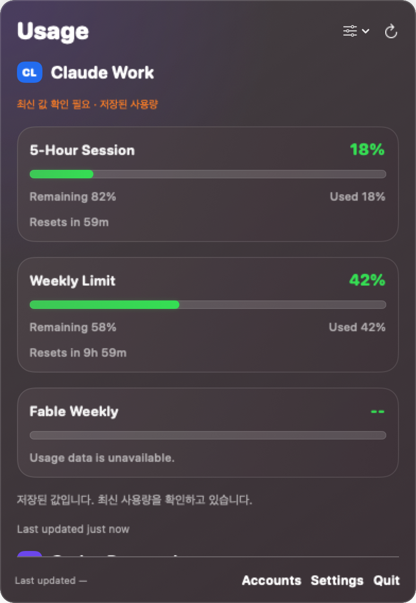

# Multi-account validation

## Release 0.1.0 — 2026-09-21

The full suite passed **126 tests across 21 suites** using the macOS 26.5 SDK:

```sh
SDKROOT=/Library/Developer/CommandLineTools/SDKs/MacOSX26.5.sdk swift test
```

Current coverage includes saved account-order persistence, account insertion/deletion synchronization,
unchanged account identities and usage-line selections after reordering, drag destination geometry,
empty-slot moves, out-of-bounds cancellation, group-position persistence, Text Only slot repair,
and noninteractive background Keychain access. Existing provider, cancellation, refresh, isolation,
migration, and rendering checks also pass.

Manual checks on the installed Apple Silicon app verified:

- Account, group, and usage-line dragging in Settings, including cancellation and empty-slot moves.
- Changed account order immediately appears in the usage-line account picker while preserving its selection.
- Account order survives app restart. Test moves were returned to the user's original configuration.
- The currently installed app uses the default browser for sign-in; account swapping is absent.

The public app is an Apple Silicon release build, ad-hoc signed and not notarized by Apple.
Intel binaries and a clean-machine installation are not validated in this release. Direct menu-bar
drag routing and saved position mapping are covered by tests; the physical menu-bar drag gesture
was not separately verified during release acceptance. Full OAuth completion was not repeated
as part of the release checks.

The remaining sections are historical validation from the earlier multi-account integration;
references to the isolated login window and the older display controls describe that earlier build.

## Automated checks

On macOS, `AGENTBAR_QA_ARTIFACT_DIR=/tmp/agentbar-pr-final-ui AGENTBAR_LIVE_AUTH_PROBE=1 swift test` passed 95 tests across 18 suites on 2026-09-15.
`git diff --check` and `zsh -n scripts/build-app.sh` also passed.
The integrated release bundle was built with `./scripts/build-app.sh` and signature-verified on 2026-09-15. It was not installed over the running personal app. Earlier local installation acceptance is listed separately below.

Coverage includes account registry persistence and permissions; credential/cache isolation;
identity comparison; rejection of results from replaced credentials; process cancellation,
and timeouts; the authentication callback actor hop; display assignment,
movement, inactive-item restoration, metric availability, and native image rendering.

Optional CLI probes require `AGENTBAR_LIVE_AUTH_PROBE=1`. They exercise OAuth startup
and cancellation without signing in. Ordinary tests do not establish live authentication.
Rendering artifacts can be generated with `AGENTBAR_QA_ARTIFACT_DIR=<directory> swift test`.
Fixture accounts and usage values are synthetic.

## Maintainer review

The review reproduced a SIGPIPE termination when writing to a CLI that had already
exited. The process transport now disables SIGPIPE on its input descriptor so the
write throws instead of terminating AgentBar. A regression test writes to an exited
process, and the RPC fixtures now wait for the actual initialization/request handshake.

All 96 tests across 18 suites passed with installed Claude/Codex startup-and-cancel
probes enabled. On the review Mac, the Swift 6.4 Command Line Tools default build
could not find the macOS 27 SDK's SwiftUIMacros plugin. Validation used the installed
macOS 26.5 SDK and native build system:

```sh
AGENTBAR_LIVE_AUTH_PROBE=1 swift test --build-system native --sdk /Library/Developer/CommandLineTools/SDKs/MacOSX26.5.sdk
```

Full account sign-in and reconnect were not repeated during this review.

## Manual acceptance already performed

- One managed Claude account and two managed Codex accounts completed authentication.
- Both Codex accounts returned independent fresh usage from separate credential/cache directories.
- The Claude login window requested a fresh login independently of the shared browser session.
- Cancelling Codex authentication returned to the app without terminating it after the callback fix.
- Claude deletion, including exact Keychain cleanup after an invalid-owner error, and subsequent re-add succeeded.
- Global CLI credential/configuration fingerprints were unchanged during the checked installations and login attempts.
- Native Settings and the usage popover were inspected. Rendered fixtures cover 1–6 rows,
  both display scales, and all eight badge/bar/percentage combinations.

## Remaining acceptance limits

- A second real Claude account was unavailable; two-Claude-account isolation is not live-verified.
- The real Codex accounts did not report a 5-hour window; its later appearance is fixture-tested.
- Native rename and metric selection from both menus, account hiding/showing, and Accounts/Usage
  navigation were exercised in an isolated UI harness. Its only source difference was opening Accounts
  rather than Settings at startup; the views, menus, and persistence code were the product code.
  The harness used a separate bundle ID, defaults suite, and synthetic account store. It did not verify
  physical menu-bar click coordinates or complete the full account-move/reconnect interaction matrix.
- Earlier reports of an invisible OAuth window and one failed Claude-add attempt did not yield
  independent root causes; subsequent attempts succeeded. Do not treat those symptoms as fully explained.
- Full real-account OAuth completion was checked before upstream integration. After integration,
  installed-CLI startup/cancel probes passed for both providers; full login was not repeated.
- New interface strings use English consistently with upstream. Additional translations are not included.

## Upstream integration

Integrated on top of `a0634a2`, retaining its dependency pins and duration-based Codex mapping,
including mixed legacy/tagged windows and absent weekly windows. Provider preferences migrate once
into active/inactive items. Hiding an account stops manual and automatic polling; queued requests
are excluded, in-flight results are discarded, and newly shown accounts are queued without
refetching unaffected accounts. Unavailable but selected metrics remain eligible for polling.
Provider retry delays still apply. An already-dispatched HTTP request may finish in the background.

The provider-level visibility tests were ported to account-level scheduling with injected loaders.
The old provider-segment click tests now check each physical item's actual popover root and
restoration after hiding. Pure component layout tests remain. Launcher tests now exercise CodexRPC
and verify descendant cleanup, native/env-node launchers, timeout, and redaction of raw provider errors.
Registry-load failure is covered to ensure existing display assignments are not erased.

## Rendered fixtures

These images contain synthetic accounts and cached sample values, not live account information.




## Review fixes verified before submission

- The refresh timer uses the emitted new interval, rather than the previous stored value. The
  regression that previously observed 120 seconds after selecting 300 now passes.
- Retry deadlines are retained for the matching credential generation even when hiding prevents
  publication of its usage response. The hidden in-flight rate-limit regression now passes.
- Claude receives the account cancellation control, passes it through CLI status checking, and checks
  it again before starting subsequent credential/HTTP steps. Tests cover pre-cancellation and
  cancellation during the status step. Already-sent HTTP requests can finish; their usage is discarded.
- Re-showing an account clears the paused explanation while preserving sign-in-required state.
- CLI tests separate initialization from the requested response timeout and assert the specific
  sanitized provider error. Process cleanup remains tested against SIGTERM-ignoring descendants.
